# Contributing Guidelines

**Follow these steps to contribute changes:**

1. Fork this repository
1. Write tests for your changes
1. Write code which makes the tests pass
1. Refactor your code and tests if necessary
1. Commit your changes
1. Open a pull request back into the `main` branch of this repository

**Follow these guidelines:**

1. [Use version control](#use-version-control)
2. [Use trunk-based development](#use-trunk-based-development)
3. [Use test-driven development](#use-test-driven-development)
4. [Use continuous integration](#use-continuous-integration)
5. [Use continuous delivery](#use-continuous-delivery)
6. [Prioritize throughput and stability](prioritize-throughput-and-stability)
7. [Use pair programming](#use-pair-programming)
8. [Keep a changelog](#keep-a-changelog)
9. [Write documentation](#write-documentation)
10. [Write maintainable code](#write-maintainable-code)

## Use version control

> "With version control, every change made to the code base is tracked. This allows software developers to see the entire history of who changed what at any given time — and roll back from the current version to an earlier version if they need to. It also creates a single source of truth. Version control serves as a safety net to protect the source code from irreparable harm, giving the development team the freedom to experiment without fear of causing damage or creating code conflicts."
>
> https://about.gitlab.com/topics/version-control/

## Use trunk-based development

> "Trunk-based development, done in a disciplined way, streamlines the development process, enhances team collaboration, improves code stability, supports efficient CI/CD practices, and may result in less technical debt. While it may be challenging to adapt to this approach if you've been working with a branch-based model, the long-term benefits are worthwhile."
>
> https://trishagee.com/2023/05/29/why-i-prefer-trunk-based-development/

## Use test-driven development

> "TDD (test-driven development), is a technique — or a _process_ for developing software. The goal is to keep code quality high and keep you productive, even as projects grow to be really large and complex. We should like this process because it keeps tight feedback loops. It gives us the ability to produce cleaner, simpler designs and helps us introduce abstractions only when they are absolutely necessary."
>
> https://khalilstemmler.com/articles/test-driven-development/introduction-to-tdd/

## Use continuous integration

Continuous Integration (CI) involves integrating code changes frequently into a single branch while automating the build and test process. Developers commit their changes multiple times a day, triggering automated builds, unit tests, integration tests, and code quality checks. This practice enables early detection of integration issues, promotes collaboration, and maintains a consistently releasable codebase.

## Use continuous delivery

Continuous Delivery (CD) extends Continuous Integration by not only integrating code changes frequently but also automating the entire software delivery process. This ensures that every commit can be potentially released to production within an hour. CD enables organizations to deliver value to customers more frequently, respond to market demands rapidly, and maintain a high level of software quality.

## Prioritize throughput and stability

Software engineers at elite organizations prioritize both throughput and stability because they recognize the importance of delivering value to customers at a rapid pace while maintaining a robust and reliable software system. Prioritizing throughput ensures that features, improvements, and bug fixes are delivered quickly, enabling the organization to respond to market demands and stay ahead of competitors.

Simultaneously, emphasizing stability ensures that the software operates consistently and reliably, providing a positive user experience and minimizing disruptions. By striking the right balance between throughput and stability, elite organizations can achieve sustainable growth, customer satisfaction, and maintain a solid foundation for continuous innovation.

## Use pair programming

> "Pair programming improves design quality, reduces defects, reduces staffing risk, enhances technical skills, improves team communications and is considered more enjoyable at statistically significant levels."
>
> https://web.eecs.umich.edu/~weimerw/2021-481F/readings/pairprogramming.pdf

## Keep a changelog

> "A changelog is a file which contains a curated, chronologically ordered list of notable changes for each version of a project. This makes it easier for users and contributors to see precisely what notable changes have been made between each release (or version) of the project. Whether consumers or developers, the end users of software are human beings who care about what's in the software. When the software changes, people want to know why and how."
>
> https://keepachangelog.com/

## Write documentation

> "You have written a piece of code, and released it into the world. You have done this because you think that others might find it useful. However, people need to understand why your code might be useful for them, before they decide to use it. Documentation tells people that this project is for them.
>
> Writing documentation improves the design of your code. Talking through your API and design decisions on paper allows you to think about them in a more formalized way. A nice side effect is that it allows people to contribute code that follows your original intentions as well."
>
> https://www.writethedocs.org/guide/writing/beginners-guide-to-docs/

## Write maintainable code

To write maintainable code, follow a set of principles and practices that promote simplicity, modularity, and automation. Break your code into short, focused units that are easy to understand and modify. Keep the units simple, avoiding unnecessary complexity. Strive to write code once, avoiding duplication. Keep unit interfaces small and focused to ensure cohesion and minimize dependencies.

Separate concerns into modules, ensuring each module has a clear and distinct purpose. Couple architecture components loosely to allow for flexibility and scalability. Maintain a balanced architecture to prevent any single component from becoming overwhelming. Keep your codebase small by removing unnecessary code and dependencies. Automate your development pipeline and tests to ensure consistent and reliable builds.

Lastly, write clean code by following best practices, adhering to naming conventions, and using proper documentation. By applying these principles, you can create maintainable code that is easier to manage, update, and extend over time.
